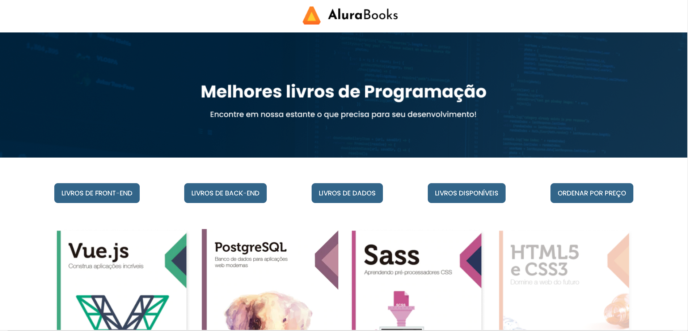

<h1 align="center">Alura Books</h1>

Projeto desenvolvido durante o curso de Front-End ONE-T5 oferecido pela Alura em parceria com a Oracle Next Education.  

  <a href="#-tecnologias">Tecnologias</a>&nbsp;&nbsp;&nbsp;|&nbsp;&nbsp;&nbsp;
  <a href="#-projeto">Projeto</a>&nbsp;&nbsp;&nbsp;

 

  

## 🚀 Tecnologias

Esse projeto foi desenvolvido com as seguintes tecnologias:

- HTML e CSS
- JavaScript
- Git e Github

## 💻 Projeto

O projeto é destinado à prática do conteúdo ensinado no curso de formação Front-End Alura / ONE-T5.

- [Visite o projeto online](https://brunanasser.github.io/alura-books/)